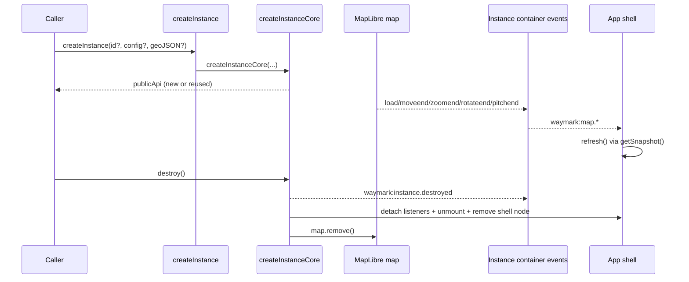

# Waymark JS

Waymark JS is a small JavaScript map library built on [MapLibre GL](https://maplibre.org/). It exposes a simple `createInstance(...)` API, forwards map configuration through `config.map.options`, and gives direct access to the underlying MapLibre instance.

**Key facts:**
- Entry point: `import { createInstance } from './dist/waymark.js'`
- Source: `src/` — built with Vite into `dist/`
- Tests: `npm test` and `npm run test:browser` (workflow in `docs/1.development.md`)
- Docs source: `docs/` (also generates this skill file)

---

# Development

> Contributor guide for working on the Waymark JS library itself.

## Local workflow

1. Install dependencies: `npm install`
2. Start dev server: `npm run dev`
3. Build library output: `npm run build`
4. Format files: `npm run format`

Formatting is enforced with Prettier (`.prettierrc.json`) using two-space indentation (`tabWidth: 2`) and spaces instead of tabs (`useTabs: false`).

Vite compiles Vue single-file components through `@vitejs/plugin-vue` (`vite.config.js`), which is required for the instance shell UI.

`npm run build` also runs `node scripts/skill-md.js`, which regenerates `.agents/skills/waymark-js/SKILL.md` from the current `docs/*.md` files.

> [!NOTE]
> If you change docs content, run `npm run build` before shipping so the generated skill file stays in sync.

The dev app is `index.html` and loads `src/dev.js`, which creates two vertically stacked instances (`map` and `map-two`) with different `map.options` view/style defaults, logs selected container events to `console.info` (`[waymark:dev:event] ...`), and exposes `window.createWaymarkInstance`, `window.waymarkInstance`, and `window.waymarkInstanceTwo` for browser tests and debugging.

## Instance shell notes

- Waymark mounts a Vue SFC shell per instance (`src/ui/InstanceShell.vue`, mounted by `src/ui/createAppShell.js`).
- The snapshot panel live-updates from forwarded container events (`waymark:map.load`, `waymark:map.moveend`, `waymark:map.zoomend`, `waymark:map.rotateend`, `waymark:map.pitchend`) via the shell refresh wiring in `src/ui/createAppShell.js`.
- `window.createWaymarkInstance`, `window.waymarkInstance`, and `window.waymarkInstanceTwo` are development globals from `src/dev.js` only (not part of the library export surface).

## Testing

Tests protect the public docs and API behaviour:

- `tests/docs/` (Vitest + jsdom) verifies documented factory/config behaviour without WebGL.
- `tests/browser/` (Playwright) smoke-tests the real browser setup and checks the dev page behaviour from `src/dev.js`.

Run:

```bash
npm run format:check
npm test
npm run test:browser
```

### Docs ↔ tests sync pattern

Treat docs and tests as one contract. When you change one, change the other in the same slice.

| Docs page             | Unit tests                       | Browser tests                       |
| --------------------- | -------------------------------- | ----------------------------------- |
| `docs/2.instances.md` | `tests/docs/2.instances.test.js` | `tests/browser/2.instances.test.js` |
| `docs/3.config.md`    | `tests/docs/3.config.test.js`    | `tests/browser/3.config.test.js`    |

Sync checklist:

1. Update docs section wording/examples.
2. Update matching test `describe` blocks and assertions.
3. Run `npm test` and `npm run test:browser`.
4. Confirm no stale filenames or headings remain.


---

# Instances

> Create Waymark instances and access the underlying MapLibre map.

## Quick Start

Waymark wraps [MapLibre GL](https://maplibre.org/) into a simple instance factory. Point it at a DOM element and it will render an interactive map.

```html
<!-- Map container -->
<div id="map" style="width: 100%; height: 400px;"></div>

<script type="module">
  import { createInstance } from "./dist/waymark.js";

  const instance = createInstance("map");
</script>
```

## What an instance is

An instance is the public object returned by `createInstance(...)`. It wraps one MapLibre map mounted to one container ID and exposes a minimal API:

- `id`
- `map`
- `config`
- `getSnapshot()`
- `destroy()`
- `on(type, handler, options?)`
- `off(type, handler, options?)`
- `once(type, handler, options?)`

Runtime orchestration is internal (`src/core/*`). Serialisable data is exposed via snapshots (`src/state/*`).

## Instance core architecture

`createInstance(...)` delegates to `createInstanceCore(...)`, which composes top-level modules around one instance ID.

| Module                                                                          | Responsibility                                                                                            |
| ------------------------------------------------------------------------------- | --------------------------------------------------------------------------------------------------------- |
| [`src/core/createInstanceCore.js`](../src/core/createInstanceCore.js)           | Orchestrates instance creation, registry reuse, and lifecycle destroy.                                    |
| [`src/core/createInstanceEvents.js`](../src/core/createInstanceEvents.js)       | Defines namespaced instance events and forwards selected map events.                                      |
| [`src/map/ensureContainer.js`](../src/map/ensureContainer.js)                   | Validates provided container IDs or creates a random container when omitted.                              |
| [`src/config/resolveConfig.js`](../src/config/resolveConfig.js)                 | Deep-merges consumer config into defaults.                                                                |
| [`src/map/createMap.js`](../src/map/createMap.js)                               | Builds the MapLibre map from resolved `config.map.options`.                                               |
| [`src/ui/createAppShell.js`](../src/ui/createAppShell.js)                       | Mounts the Vue app shell and wires live snapshot refresh from forwarded `waymark:map.*` container events. |
| [`src/ui/InstanceShell.vue`](../src/ui/InstanceShell.vue)                       | SFC overlay UI that renders formatted snapshot JSON in a collapsible panel.                               |
| [`src/geojson/createGeoJSONModule.js`](../src/geojson/createGeoJSONModule.js)   | Creates an instance-scoped GeoJSON source/layer module.                                                   |
| [`src/state/createInstanceSnapshot.js`](../src/state/createInstanceSnapshot.js) | Produces serialisable per-instance snapshots.                                                             |
| [`src/core/runtimeRegistry.js`](../src/core/runtimeRegistry.js)                 | Stores, fetches, and clears ID-scoped runtime cores.                                                      |

## Factory defaults

Default map values come from config defaults (`map.options.center: [0, 0]`, `map.options.zoom: 2`, `map.options.style: https://tiles.openfreemap.org/styles/bright`, `map.options.attributionControl: false`).

## Factory signature

`createInstance(id?, config?, geoJSON?)`

| Parameter | Type     | Required | Description                                                                                                                                 |
| --------- | -------- | -------- | ------------------------------------------------------------------------------------------------------------------------------------------- |
| `id`      | `string` | No       | The `id` of the DOM element to mount into. A random container is created when omitted. Throws if a provided `id` does not exist in the DOM. |
| `config`  | `object` | No       | Config object (see [docs/3.config.md](3.config.md))                                                                                         |
| `geoJSON` | `object` | No       | Initial GeoJSON overlay rendered on map load.                                                                                               |

## Factory options

### Example with options

```js
const instance = createInstance("map", {
  map: {
    options: {
      center: [-0.1276, 51.5074], // London
      zoom: 10,
      bearing: 15,
      style: "https://tiles.openfreemap.org/styles/bright",
    },
  },
});
```

`map.options` is forwarded to the MapLibre constructor (`new Map(options)`), with Waymark always overriding `container` from `createInstance(id)`.

## Accessing the MapLibre instance

The `map` property in the returned instance object is the underlying [`maplibre-gl` Map](https://maplibre.org/maplibre-gl-js/docs/API/classes/Map/) instance.

```js
const instance = createInstance("map");

// Use the full MapLibre GL API
instance.map.on("load", () => {
  console.log("Map loaded");
});
```

## Instance registry behaviour

`createInstance()` is instance-first and ID-scoped. If an instance already exists for the same container ID, Waymark returns the existing instance object rather than creating a second map.

The runtime registry in [`src/core/runtimeRegistry.js`](../src/core/runtimeRegistry.js) is internal lifecycle infrastructure. It is not part of the serialisable instance snapshot returned by `getSnapshot()`.

> [!NOTE]
> Keep the boundary explicit:
>
> - **Public/serialisable:** `instance.getSnapshot()` from `src/state/createInstanceSnapshot.js`.
> - **Internal/runtime:** core lifecycle state in `src/core/createInstanceCore.js` and `src/core/runtimeRegistry.js`.

## Instance event API

Waymark dispatches `CustomEvent`s from the instance container element. This gives a lightweight namespaced event surface for both lifecycle and selected MapLibre events.

> [!NOTE]
> `waymark:instance.created` is emitted during `createInstance(...)` creation. To observe that first event, attach the listener on the container before calling `createInstance(...)`.

```js
const instance = createInstance("map");

function handleDestroyed(event) {
  console.log(event.type, event.detail.id);
}

instance.on("waymark:instance.destroyed", handleDestroyed);
instance.off("waymark:instance.destroyed", handleDestroyed);
instance.once("waymark:instance.reused", (event) => {
  console.log(event.detail.id);
});
```

Lifecycle events emitted by this slice:

- `waymark:instance.created`
- `waymark:instance.reused`
- `waymark:instance.destroyed`

All lifecycle events use the same lightweight detail payload:

```js
{
  id: string;
}
```

Forwarded map events (performance-safe defaults):

- `waymark:map.load`
- `waymark:map.moveend`
- `waymark:map.zoomend`
- `waymark:map.rotateend`
- `waymark:map.pitchend`

Each forwarded map event includes:

```js
{
  id: string,
  mapEvent: "load" | "moveend" | "zoomend" | "rotateend" | "pitchend",
  originalEvent: unknown,
}
```

`moveend` is forwarded instead of high-frequency `move` to keep event defaults lightweight.

## Returned instance shape

`createInstance(...)` returns:

```js
{
  id: string,
  map: MapLibreMap,
  config: object,
  getSnapshot: () => InstanceSnapshot,
  destroy: () => void,
  on: (type, handler, options?) => void,
  off: (type, handler, options?) => void,
  once: (type, handler, options?) => void
}
```

- `map` is the underlying MapLibre map.
- `config` is the resolved per-instance config snapshot.
- `getSnapshot()` returns a plain serialisable object.
- `destroy()` removes shell listeners, unmounts the Vue shell, removes the map, and releases the internal registry entry for that ID.
- `on()`, `off()`, and `once()` subscribe to `CustomEvent`s dispatched from the instance container.

Calling `destroy()` more than once is safe.

## Live snapshot overlay shell

Each instance mounts `InstanceShell.vue` through `createAppShell(...)`, rendering an `Instance snapshot` panel inside the map container.

The panel content refreshes from forwarded container events (`waymark:map.load`, `waymark:map.moveend`, `waymark:map.zoomend`, `waymark:map.rotateend`, `waymark:map.pitchend`) and reflects the current `getSnapshot()` output.

In `createInstanceCore(...)`, shell refresh uses a safe snapshot getter (`core?.snapshot?.getSnapshot() ?? null`) until the snapshot module is initialised, then forces a refresh once snapshot wiring is ready.

## Serialisable per-instance snapshot

`instance.getSnapshot()` returns:

```js
{
  version: 1,
  map: {
    center: [lng, lat],
    zoom: number,
    bearing: number,
    pitch: number,
  },
  ui: {
    hasAppShell: boolean,
  },
  data: {
    geojson: {
      sourceId: string,
      layerId: string,
      geojson: object | null,
    },
  },
}
```

This snapshot is intentionally minimal for now, but explicit and serialisable.

This snapshot comes from [`src/state/createInstanceSnapshot.js`](../src/state/createInstanceSnapshot.js). It is separate from the internal runtime registry used to track active cores.

## Initial GeoJSON on instance creation

`createInstance(id?, config?, geoJSON?)` accepts an optional third argument. When `geoJSON` is provided, Waymark adds a GeoJSON source and line layer for that instance (on load, or immediately if the map is already loaded).

```js
const geoJSON = {
  type: "FeatureCollection",
  features: [
    {
      type: "Feature",
      geometry: {
        type: "LineString",
        coordinates: [
          [-0.13, 51.5],
          [-0.12, 51.51],
        ],
      },
      properties: {},
    },
  ],
};

const instance = createInstance("map", undefined, geoJSON);
```

GeoJSON source and layer IDs are scoped by instance ID to avoid collisions between multiple maps on the same page.

- Sources:
  - [`src/entry.js`](../src/entry.js)
  - [`src/core/createInstanceCore.js`](../src/core/createInstanceCore.js)
  - [`src/core/createInstanceEvents.js`](../src/core/createInstanceEvents.js)
  - [`src/config/resolveConfig.js`](../src/config/resolveConfig.js)
  - [`src/map/ensureContainer.js`](../src/map/ensureContainer.js)
  - [`src/map/createMap.js`](../src/map/createMap.js)
  - [`src/geojson/createGeoJSONModule.js`](../src/geojson/createGeoJSONModule.js)
  - [`src/state/createInstanceSnapshot.js`](../src/state/createInstanceSnapshot.js)
  - [`src/core/runtimeRegistry.js`](../src/core/runtimeRegistry.js)
  - [`src/ui/createAppShell.js`](../src/ui/createAppShell.js)


---

# Config

> Configuration reference for `createInstance(id?, config?, geoJSON?)`.

## createInstance signature

`createInstance(id?, config?, geoJSON?)`

- `id` (`string`, optional): DOM element ID to mount into.
- `config` (`object`, optional): configuration object.
- `geoJSON` (`object`, optional): initial GeoJSON data to render after map load.

When `geoJSON` is provided, Waymark creates an instance-scoped GeoJSON source and line layer during initial load.

```js
createInstance("map", undefined, {
  type: "FeatureCollection",
  features: [],
});
```

All map settings live under `config.map`. Other namespaces may be added as the library grows.

## Default config source and merge behaviour

Default values come from `src/config/defaultConfig.json`:

```js
{
  map: {
    options: {
      center: [0, 0],
      zoom: 2,
      style: "https://tiles.openfreemap.org/styles/bright",
      attributionControl: false,
    },
  },
}
```

Waymark resolves config with a deep merge:

- Base: `defaultConfig.json`
- Override: consumer `config`
- Objects merge recursively by key
- Arrays are replaced entirely (never merged by index)

`config.map.options` is passed through to the MapLibre constructor (`new Map(options)`), except `container`, which Waymark always sets from `createInstance(id)`.

## Defaults

- `map.options.center`: `[0, 0]`
- `map.options.zoom`: `2`
- `map.options.style`: OpenFreeMap Bright style URL (`https://tiles.openfreemap.org/styles/bright`)
- `map.options.attributionControl`: `false`

## config.map

| Option    | Type     | Default                                                                                                        | Description                                                                                            |
| --------- | -------- | -------------------------------------------------------------------------------------------------------------- | ------------------------------------------------------------------------------------------------------ |
| `options` | `object` | `{ center: [0, 0], zoom: 2, style: "https://tiles.openfreemap.org/styles/bright", attributionControl: false }` | MapLibre constructor options. Forwarded to `new Map(options)` (except Waymark-controlled `container`). |

## config.map.options

Use this object for MapLibre map constructor options.

| Property                                                                                               | Type  | Required | Description                                                               |
| ------------------------------------------------------------------------------------------------------ | ----- | -------- | ------------------------------------------------------------------------- |
| Any valid [MapLibre Map option](https://maplibre.org/maplibre-gl-js/docs/API/type-aliases/MapOptions/) | `any` | No       | Passed through to `new Map(options)` except `container` (set by Waymark). |

Common options:

| Property             | Type               | Default                                       | Description                                               |
| -------------------- | ------------------ | --------------------------------------------- | --------------------------------------------------------- |
| `center`             | `[number, number]` | `[0, 0]`                                      | Initial map centre as `[lng, lat]`                        |
| `zoom`               | `number`           | `2`                                           | Initial zoom level                                        |
| `style`              | `string \| object` | `https://tiles.openfreemap.org/styles/bright` | MapLibre style URL or inline style specification          |
| `attributionControl` | `boolean`          | `false`                                       | Whether MapLibre renders its default attribution control. |

```js
createInstance("map", {
  map: {
    options: {
      center: [-0.1276, 51.5074],
      zoom: 10,
      bearing: 15,
      pitch: 45,
      style: "https://tiles.openfreemap.org/styles/bright",
    },
  },
});
```

---

- Sources:
  - [`src/config/defaultConfig.json`](../src/config/defaultConfig.json)
  - [`src/config/resolveConfig.js`](../src/config/resolveConfig.js)
  - [`src/core/createInstanceCore.js`](../src/core/createInstanceCore.js)
  - [`src/map/createMap.js`](../src/map/createMap.js)
  - [`src/utils/deepMerge.js`](../src/utils/deepMerge.js)


---

# Naming

> Canonical naming used across source, tests, and docs.

## What an instance is

An **instance** is the public object returned by `createInstance(...)`. It represents one mounted map and exposes:

- `id`
- `map`
- `config`
- `getSnapshot()`
- `destroy()`
- `on(type, handler, options?)`
- `off(type, handler, options?)`
- `once(type, handler, options?)`

## Glossary

| Term                 | Meaning                                                             |
| -------------------- | ------------------------------------------------------------------- |
| **Runtime core**     | Internal lifecycle object used by `src/core/createInstanceCore.js`. |
| **Runtime registry** | Internal ID→core map in `src/core/runtimeRegistry.js`.              |
| **Snapshot**         | Serialisable object returned by `instance.getSnapshot()`.           |
| **Snapshot payload** | The serialisable output shape (including `data.geojson`).           |
| **GeoJSON**          | Input data format for overlays and related module symbols.          |

## Naming rules

- Use **`getSnapshot()`** (not `getState()`) for the public snapshot API.
- Keep runtime naming internal (`core`, `runtimeRegistry`) and snapshot naming serialisable/public (`snapshot`).
- Use **GeoJSON** capitalisation in symbols and docs (`createGeoJSONModule`, `geoJSON` variables).


---

# Modules

> How `createInstanceCore(...)` composes instance modules and keeps complexity bounded as Waymark grows.

## Why modules exist

`src/core/createInstanceCore.js` keeps one instance readable by delegating focused concerns into modules (`geoJSON`, `mapEvents`, `appShell`, `snapshot`) rather than expanding one monolithic factory.

This keeps growth additive: new behaviour can be added as a module with explicit wiring and teardown, without changing the public instance API shape.

## Current module responsibilities

| Module                                                                                                            | Responsibility                                                                                            |
| ----------------------------------------------------------------------------------------------------------------- | --------------------------------------------------------------------------------------------------------- |
| [`src/ui/createAppShell.js`](../src/ui/createAppShell.js)                                                         | Mounts/unmounts the Vue shell and refreshes snapshot UI from forwarded map events.                        |
| [`src/geojson/createGeoJSONModule.js`](../src/geojson/createGeoJSONModule.js)                                     | Adds optional instance-scoped GeoJSON source/layer on map load and detaches its load listener on destroy. |
| [`src/core/createInstanceEvents.js`](../src/core/createInstanceEvents.js) (`forwardMapEventsToInstanceContainer`) | Forwards selected map end-events as `waymark:map.*` container `CustomEvent`s.                             |
| [`src/state/createInstanceSnapshot.js`](../src/state/createInstanceSnapshot.js)                                   | Returns serialisable snapshot payloads from runtime map/module state.                                     |

## Lifecycle ordering in `createInstanceCore(...)`

1. Resolve container ID (`ensureContainer`) and check registry reuse.
2. For new instances: resolve config, create container event bus, create MapLibre map.
3. Create modules (`appShell`, `geoJSON`, `mapEvents`) and assemble `core`.
4. Create snapshot module and force one shell refresh after snapshot wiring is ready.
5. Build public API (`id`, `map`, `config`, `getSnapshot`, `destroy`, `on/off/once`), register core, emit `waymark:instance.created`.

On `destroy()`:

1. Mark lifecycle `destroyed` and emit `waymark:instance.destroyed`.
2. Destroy modules (`geoJSON`, `mapEvents`, then `appShell` listener detach/unmount/remove).
3. Remove MapLibre map and delete registry entry.

`destroy()` is idempotent; repeated calls no-op after phase switches to `destroyed`.

## Event flow (create → forwarded events → shell refresh → destroy)



## Module extension contract

When adding a new module to `createInstanceCore(...)`, keep the contract consistent:

- **Factory in, handle out:** module factories accept explicit dependencies (for example `map`, `id`, `events`) and return a small object handle.
- **Deterministic teardown:** module handle exposes `destroy()` and can be called from `destroyCore(...)` in a predictable order.
- **Instance-scoped naming:** any generated IDs should include/sanitise the instance ID to avoid cross-instance collisions.
- **Public API stability:** module wiring should stay behind `createInstance(...)`; avoid expanding public API unless intentionally versioned/documented.
- **Snapshot boundary:** runtime helpers stay internal; serialisable outputs remain in `getSnapshot()`.

## Unintuitive behaviours to know

> [!NOTE]
> Reuse is ID-first, not argument-first.
>
> If `createInstance(...)` is called again with the same container ID, Waymark returns the existing public instance and emits `waymark:instance.reused`. New `config` or `geoJSON` arguments are ignored on that reuse path.

> [!NOTE]
> Omitting `id` auto-creates and appends a random `<div>` to `document.body`.
>
> This is convenient for quick demos/tests, but the generated container has no layout styles by default.

> [!NOTE]
> `waymark:instance.destroyed` is emitted before module/map teardown.
>
> During that event callback, listeners still run against a core that has not yet removed the map or shell.

---

- Sources:
  - [`src/core/createInstanceCore.js`](../src/core/createInstanceCore.js)
  - [`src/core/createInstanceEvents.js`](../src/core/createInstanceEvents.js)
  - [`src/ui/createAppShell.js`](../src/ui/createAppShell.js)
  - [`src/geojson/createGeoJSONModule.js`](../src/geojson/createGeoJSONModule.js)
  - [`src/map/ensureContainer.js`](../src/map/ensureContainer.js)
  - [`src/map/createMap.js`](../src/map/createMap.js)
  - [`src/state/createInstanceSnapshot.js`](../src/state/createInstanceSnapshot.js)
  - [`src/core/runtimeRegistry.js`](../src/core/runtimeRegistry.js)


---

# Documentation Index

Developer documentation for Waymark JS.

## Reading order

1. [Development](1.development.md) - Local workflow, test commands, and docs↔tests sync rules.
2. [Instances](2.instances.md) - `createInstance(...)` usage, instance framing, and lifecycle behaviour.
3. [Config](3.config.md) - Config contract for `config.map.options` (including style-only setup).
4. [Naming](4.naming.md) - Canonical naming for runtime cores, snapshots, and GeoJSON.
5. [Modules](5.modules.md) - Instance wrapper/module architecture, lifecycle ordering, and extension contract.

## Scope

These docs describe the current instance-first API surface and top-level module layout. `config.map.options` is forwarded to MapLibre with Waymark overriding `container`, map styling is configured through `config.map.options.style`, and snapshot/runtime naming is defined in the naming glossary.

