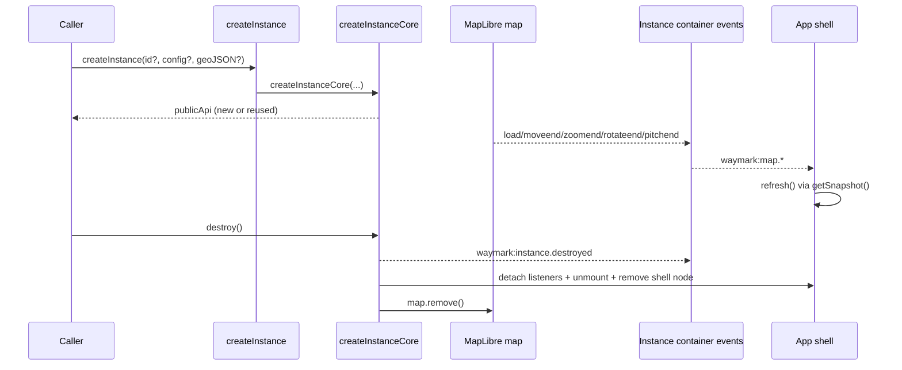

# Modules

> How `createInstanceCore(...)` composes instance modules and keeps complexity bounded as Waymark grows.

## Why modules exist

`src/core/createInstanceCore.js` keeps one instance readable by delegating focused concerns into modules (`geoJSON`, `mapEvents`, `appShell`, `snapshot`) rather than expanding one monolithic factory.

This keeps growth additive: new behaviour can be added as a module with explicit wiring and teardown, without changing the public instance API shape.

## Current module responsibilities

| Module                                                                                                            | Responsibility                                                                                            |
| ----------------------------------------------------------------------------------------------------------------- | --------------------------------------------------------------------------------------------------------- |
| [`src/ui/createAppShell.js`](../src/ui/createAppShell.js)                                                         | Mounts/unmounts the Vue shell and refreshes snapshot UI from forwarded map events.                        |
| [`src/geojson/createGeoJSONModule.js`](../src/geojson/createGeoJSONModule.js)                                     | Adds optional instance-scoped GeoJSON source/layer on map load and detaches its load listener on destroy. |
| [`src/core/createInstanceEvents.js`](../src/core/createInstanceEvents.js) (`forwardMapEventsToInstanceContainer`) | Forwards selected map end-events as `waymark:map.*` container `CustomEvent`s.                             |
| [`src/state/createInstanceSnapshot.js`](../src/state/createInstanceSnapshot.js)                                   | Returns serialisable snapshot payloads from runtime map/module state.                                     |

## Lifecycle ordering in `createInstanceCore(...)`

1. Resolve container ID (`ensureContainer`) and check registry reuse.
2. For new instances: resolve config, create container event bus, create MapLibre map.
3. Create modules (`appShell`, `geoJSON`, `mapEvents`) and assemble `core`.
4. Create snapshot module and force one shell refresh after snapshot wiring is ready.
5. Build public API (`id`, `map`, `config`, `getSnapshot`, `destroy`, `on/off/once`), register core, emit `waymark:instance.created`.

On `destroy()`:

1. Mark lifecycle `destroyed` and emit `waymark:instance.destroyed`.
2. Destroy modules (`geoJSON`, `mapEvents`, then `appShell` listener detach/unmount/remove).
3. Remove MapLibre map and delete registry entry.

`destroy()` is idempotent; repeated calls no-op after phase switches to `destroyed`.

## Event flow (create → forwarded events → shell refresh → destroy)

## Module extension contract

When adding a new module to `createInstanceCore(...)`, keep the contract consistent:

- **Factory in, handle out:** module factories accept explicit dependencies (for example `map`, `id`, `events`) and return a small object handle.
- **Deterministic teardown:** module handle exposes `destroy()` and can be called from `destroyCore(...)` in a predictable order.
- **Instance-scoped naming:** any generated IDs should include/sanitise the instance ID to avoid cross-instance collisions.
- **Public API stability:** module wiring should stay behind `createInstance(...)`; avoid expanding public API unless intentionally versioned/documented.
- **Snapshot boundary:** runtime helpers stay internal; serialisable outputs remain in `getSnapshot()`.

## Unintuitive behaviours to know

> [!NOTE]
> Reuse is ID-first, not argument-first.
>
> If `createInstance(...)` is called again with the same container ID, Waymark returns the existing public instance and emits `waymark:instance.reused`. New `config` or `geoJSON` arguments are ignored on that reuse path.

> [!NOTE]
> Omitting `id` auto-creates and appends a random `
` to `document.body`.
>
> This is convenient for quick demos/tests, but the generated container has no layout styles by default.

> [!NOTE]
> `waymark:instance.destroyed` is emitted before module/map teardown.
>
> During that event callback, listeners still run against a core that has not yet removed the map or shell.

---

- Sources:
  - [`src/core/createInstanceCore.js`](../src/core/createInstanceCore.js)
  - [`src/core/createInstanceEvents.js`](../src/core/createInstanceEvents.js)
  - [`src/ui/createAppShell.js`](../src/ui/createAppShell.js)
  - [`src/geojson/createGeoJSONModule.js`](../src/geojson/createGeoJSONModule.js)
  - [`src/map/ensureContainer.js`](../src/map/ensureContainer.js)
  - [`src/map/createMap.js`](../src/map/createMap.js)
  - [`src/state/createInstanceSnapshot.js`](../src/state/createInstanceSnapshot.js)
  - [`src/core/runtimeRegistry.js`](../src/core/runtimeRegistry.js)
